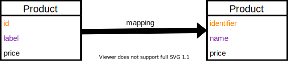



- [What is it ?](#what-is-it-)
- [Installation](#installation)
- [Usage](#usage)
  - [Building an ArrayMapper](#building-an-arraymapper)
  - [Building a ListMapper](#building-a-listmapper)
  - [Building a CollectionMapper](#building-a-collectionmapper)
  - [Building an ObjectMapper](#building-an-objectmapper)
  - [Building a ConditionalMapper](#building-a-conditionalmapper)
  
---

> A mapping is an operation that associates each element of a source of data into
> a new format of the same data. By this operation, it is possible to transform
> the way the data is represented.




## What is it ?

The FastMap plugin aims at integrating mappers into the [Pipeline](https://github.com/php-etl/pipeline) stack.

FastMap Plugin consists of two components, each with a different purpose.

### The `php-etl/fast-map` component

This component is in charge of representing the Abstract Mapping Tree, and transforming
it into compiled PHP code. This compiled PHP code is the actual code that will do the
mapping, in an optimized way.

#### Abstract Mapping Tree

The _abstract mapping tree_ is a representation of the mapping to apply to your
data, in order to transform its representation. It is an internal representation
build for a computer to understand how it will have to change the data representation
during the mapping operation.

### The `php-etl/fast-map-config` component
This component allows you to configure your mapper according to the type of data you want to input.

If you need to config your mappers, we advise you to use the yml config which will generate a php code usable by the fast-map-config.
This code will then be converted into a machine code that can be used by the fast map package.

## Installation

```shell
composer require php-etl/fast-map-plugin:'*'
```

## Usage

### Building an ArrayMapper

To write a mapping to an array, you must use the `map option.

```yaml
fastmap:
  append: true # Optional. Merges this step's output into the previous step's result.
  map:
  # ...
```

Next, you need to specify the field you are going to map to and assign a value to it.

The `field` option is based on the [PropertyAccess](https://symfony.com/doc/current/components/property_access.html)
component of Symfony. You must therefore respect this `[field_name]` naming format.

To assign a value to your field, you can choose between several options :

#### Simple options

- `copy` : This option also uses the PropertyAccess component of Symfony and allows you to retrieve a value from an array 
  and copy it.
- `expression` : This expression uses the [Expressionlanguage](https://symfony.com/doc/current/components/expression_language.html) component of Symfony
  component and allows you to write your own expressions.
- `constant` : This option allows you to write directly the value of your field

```yaml
fastmap:
  map:
    - field: '[sku]'
      copy: '[sku]'
    - field: '[title]'
      expression: 'input["sku"] ~" | "~ input["name"]'
    - field: '[staticValue]'
      constant: 'Lorem ipsum dolor sit amet, consectetur adipiscing elit. Curabitur mollis efficitur justo, id facilisis elit venenatis et.'
    # ...
```

#### Advanced options

- `map` : [see the configuration](#building-an-arraymapper)
- `list` : [see the configuration](#building-a-listmapper)
- `collection` : [see the configuration](#building-a-collectionmapper)
- `object` : [see the configuration](#building-an-objectmapper)

```yaml
fastmap: 
  map: 
    - field: '[foo]'
      expression: 'input'
      map:
        - field: '[bar]'
          copy: '[bar]'
    - field: '[foo]'
      expression: 'input'
      list:
        - field: '[bar]'
          copy: '[bar]'
    - field: '[descriptions]'
      class: 'Pipeline\Usage'
      expression: 'input["foo"]'
      object:
        - field: 'usage'
          expression: '"Usage: " ~ input["usage"]'
        - field: 'warning'
          copy: '[warning]'
        - field: 'notice'
          copy: '[notice]'
    - field: '[messages]'
      class: 'Foo\DTO\Messages'
      expression: 'input'
      collection:
        - field: 'usage'
          expression: '"Usage: " ~ input["usage"]'
        - field: 'warning'
          copy: '[warning]'
        - field: 'notice'
          copy: '[notice]'
```

### Building a ListMapper

To write a mapping to a list, you must use the `list` option, which will always be accompanied by
the `expression` option.

- `expression` : allows you to write an expression which will be used in the mapping.

```yaml
fastmap:
  expression: 'input'
  list:
    - field: '[bar]'
      copy: '[bar]'
```

### Building a CollectionMapper

To write a mapping to a collection of objects, you must use the `collection` option, which will always be accompanied 
by the `class` and `expression` options.

- `class` : determines the class to use in the mapping.
- `expression` : allows you to write an expression which will be used in the mapping.

```yaml
fastmap:
  class: 'Foo\DTO\Messages'
  expression: 'input'
  collection:
    - field: 'usage'
      expression: '"Usage: " ~ input["usage"]'
    - field: 'warning'
      copy: '[warning]'
    - field: 'notice'
      copy: '[notice]'
```

Warning: Unlike an ArrayMapper, here the field must not be between `[...]`.

See [Reading from objects](https://symfony.com/doc/current/components/property_access.html#reading-from-objects).

### Building an ObjectMapper

To write a mapping to an object, you must use the `object` option, which will always be accompanied by the
options `class` and `expression`.

- `class` : determines the class to be used in the mapping.
- `expression` : allows you to write an expression that will be used in the mapping.

```yaml
fastmap:
  class: 'Foo\DTO\Product'
  expression: 'input'
  object:
    - field: 'sku'
      copy: '[sku]'
```

Warning: Unlike an ArrayMapper, here the `field` must not be between `[...]`. 

See [Reading from objects](https://symfony.com/doc/current/components/property_access.html#reading-from-objects).

### Building a ConditionalMapper

To write a list of mappers that will only execute if a condition is met, you must use the `conditional` option,
under which you can declare multiple [Array](#building-an-arraymapper) (`map`) or [Object](#building-an-objectmapper) (`object`) mappers,
each protected by a `condition`.

The behaviour is similar to `if ... else if ...`, meaning **only 1 of the mappers will be executed**.

```yaml
fastmap:
  conditional:
    - condition: 'keyExists("sku", input)'
      append: true # Optional. Merges this step's output into the previous step's result.
      map:
        # ...
    - condition: 'keyExists("identifier", input)'
      append: true
      object:
        # ...
```
