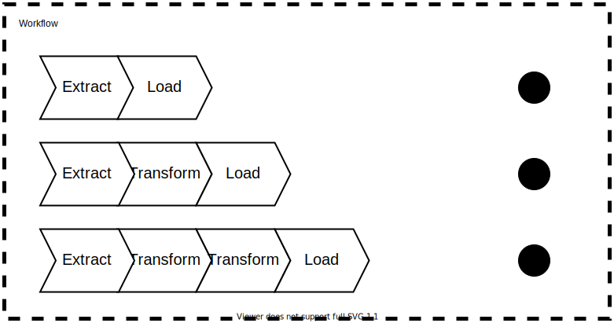

- [What is it ?](#what-is-it-)
- [Installation](#installation)
- [Basic usage](#basic-usage)
- [Advanced usage](#advanced-usage)
  - [Using expression](#using-expressions)
  - [Using services](#using-services)
    
---



## What is it ?

This package allows you to create a micro-service that will be orchestrating more than one data pipeline.

## Installation

```shell
composer require php-etl/workflow:'*'
```

## Basic usage

To define your workflow, you need to specify the `jobs` you need, that is to say your different [pipelines](../pipeline) or [actions](../action).

Each job must be identified by a code. If you forget it, you will be reminded to add it.

```yaml
workflow:
  jobs:
    job-1: # this is your job code
      pipeline:
        # ...
    job-2:
      pipeline:
        # ...
    job-3:
      action:
        # ...
```

You can declare your codes in another way, but which we find less legible. We advise you to use the first method, 
but it's good to know the 2 solutions.

```yaml
workflow:
  jobs:
    - code: 'job-1' # this is your job code
      pipeline:
        # ...
    - code: 'job-2'
      pipeline:
        # ...
    - code: 'job-3'
      action:
        # ...
```

The `name` option allows you to name your job.

```yaml
workflow:
  jobs:
    job-1:
      name: 'First Pipeline'
      pipeline:
        # the pipeline configuration
        # ...
```

## Advanced usage

### Using expressions

It's possible to use expressions in your pipeline using the `expression_language` option. To use these expressions,
you need to use our customised Providers which provide the different expressions. For more information, please visit
the [detailed documentation](../../../feature/expression-language) of the language expressions.

```yaml
pipeline:
  expression_language:
    - 'Kiboko\Component\Satellite\ExpressionLanguage\Provider'
```

### Using services

You can use services in your pipeline in the same way as in a traditional Symfony application.

For more details, go to the [detailed services documentation](../../../feature/logger).

```yaml
pipeline:
  services:
    App\Service\Bar:
      arguments:
        - 'my-file.csv'
```
