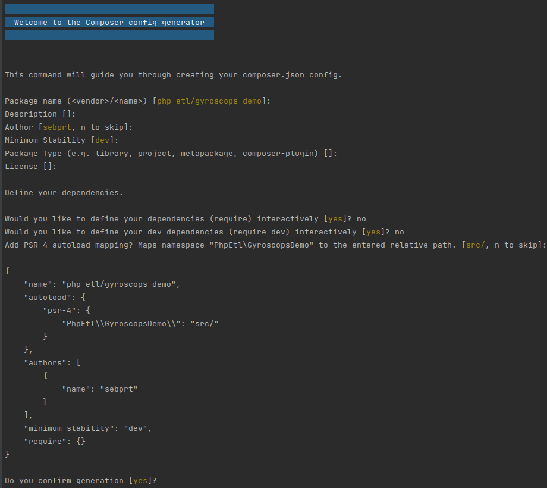

Starting from here we will work inside a project directory we will name `my_project_directory`.

```shell
mkdir my_project_directory && cd my_project_directory
```

Once the project dir is created and you have changed your current directory to it, the first task will be to initialize 
a composer project inside this directory and add all required dependencies.

```shell
composer init
```



In the auto-generated `composer.json` file, add the following lines at the end :

```json
{
// ...
    "config": {
        "bin-dir": "bin"
    },
    "scripts": {
        "post-install-cmd": [
            "Kiboko\\Component\\Satellite\\ComposerScripts::postInstall"
        ],
        "post-update-cmd": [
            "Kiboko\\Component\\Satellite\\ComposerScripts::postUpdate"
        ]
    }
}
```

Now, your environment is ready for the satellite compiler installation. The following command will install it.

```shell
composer require php-etl/satellite:'*'
```
